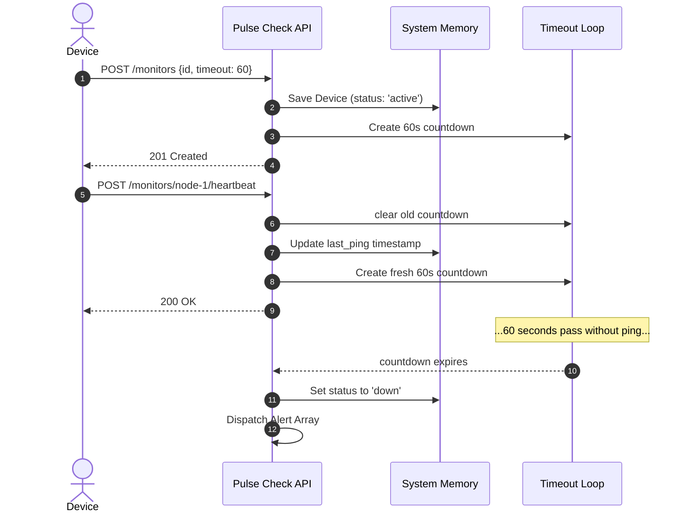

# 📡 Pulse Check API (Watchdog Sentinel)

A stateful, zero-dependency "Dead Man's Switch" API built with [Bun](https://bun.sh) for monitoring critical infrastructure. 

When remote devices—such as solar farms or unmanned weather stations—stop sending periodic heartbeats, this API automatically detects the failure and triggers an alert.

## Features
* **Zero Dependencies:** Core logic utilizes Bun's native HTTP server and JavaScript's `setTimeout` API. No Express, no Zod, no external routing libraries.
* **State Management:** Highly performant in-memory `Map` architecture for O(1) device lookups and native timer tracking.
* **Snooze Mechanism:** Easily pause monitoring for devices undergoing maintenance to prevent false alarms.
* **Auto-Recovery:** Resuming a heartbeat on a paused device automatically re-initiates the monitoring loop.

---

## Getting Started

### Prerequisites
* [Bun](https://bun.sh/) installed (`curl -fsSL https://bun.sh/install | bash`)

### Running the Server
```bash
# Clone the repository
# bun install (optional, no heavy dependencies)

# Run in development mode (hot reloading)
bun run dev

# Run in production mode
bun run start
```

*The server will start on `http://localhost:8085`*

---

## 📚 API Endpoints

### 1. Register a Monitor
Starts a countdown timer for a specific device.

The timeout uses 1 = 60 sec

* **POST** `/monitors`
* **Body:** 
  ```json
  {
    "id": "node-1", 
    "timeout": 1, 
    "alert_email": "admin@hq.com"
  }
  ```
* **Success Response (201 Created):**
  ```json
  {
    "message": "Monitor Successfully registered",
    "data": {
      "id": "node-1",
      "timeout": 1,
      "alert_email": "admin@hq.com",
      "status": "active",
      "last_ping": 1718920000000
    }
  }
  ```
* **Error Responses:**
  * `400 Bad Request`: `{"error": "Invalid JSON body provided"}` or validation errors.
  * `409 Conflict`: `{"error": "Monitor with ID 'node-1' already exists"}`

### 2. Send Heartbeat
Reset the countdown timer. If the device was snoozed (`paused`), this will reactivate it. Cannot be used on a device that is already `down`.

* **POST** `/monitors/{id}/heartbeat`
* **Success Response (200 OK):**
  ```json
  {
    "message": "Timer restarted for node-1"
  }
  ```
* **Error Responses:**
  * `404 Not Found`: `{"error": "Device not found"}`
  * `400 Bad Request`: `{"error": "Cannot heartbeat a down monitor. Manual reset required."}`

### 3. Pause Monitor
Suspend the countdown timer for maintenance. Calling this prevents alerts from firing.

* **POST** `/monitors/{id}/pause`
* **Success Response (200 OK):**
  ```json
  {
    "message": "Monitor paused successfully"
  }
  ```
  *(Returns `"Monitor paused already"` if already paused)*
* **Error Responses:**
  * `404 Not Found`: `{"error": "Device not found"}`
  * `400 Bad Request`: `{"error": "Can not pause a broken device"}`

### 4. List All Monitors (Developer's Choice Feature)
Returns the live status of all registered hardware.

* **GET** `/monitors`
* **Success Response (200 OK):**
  ```json
  {
    "total": 1,
    "data": [
      {
        "id": "node-1",
        "timeout": 1,
        "alert_email": "admin@hq.com",
        "status": "active",
        "last_ping": 1718920000000
      }
    ]
  }
  ```

---

## 🏗 System Architecture Diagram

This flowchart outlines the in-memory timer lifecycle:



---

## 🤔 Technical Decisions & Developer's Choice

### The "Developer's Choice" (Task 7)
**Feature Implemented:** `GET /monitors` (Global List Endpoint)

**Why I added it:**
In a headless application managing background timers, state exists entirely invisibly in memory. I implemented a `GET` endpoint to expose these internal values so an external dashboard could poll the total system health. It transforms a "black-box" timeout engine into an inspectable service.

### Why zero-dependencies?
To meet the core challenge requirements, validation logic usually handled by `zod` and routing usually handled by `express` was handled directly using Bun's native Request handler loop. Timeouts rely entirely on Javascript's native garbage-collected `setTimeout` API rather than heavy queueing networks like Redis/BullMQ.
